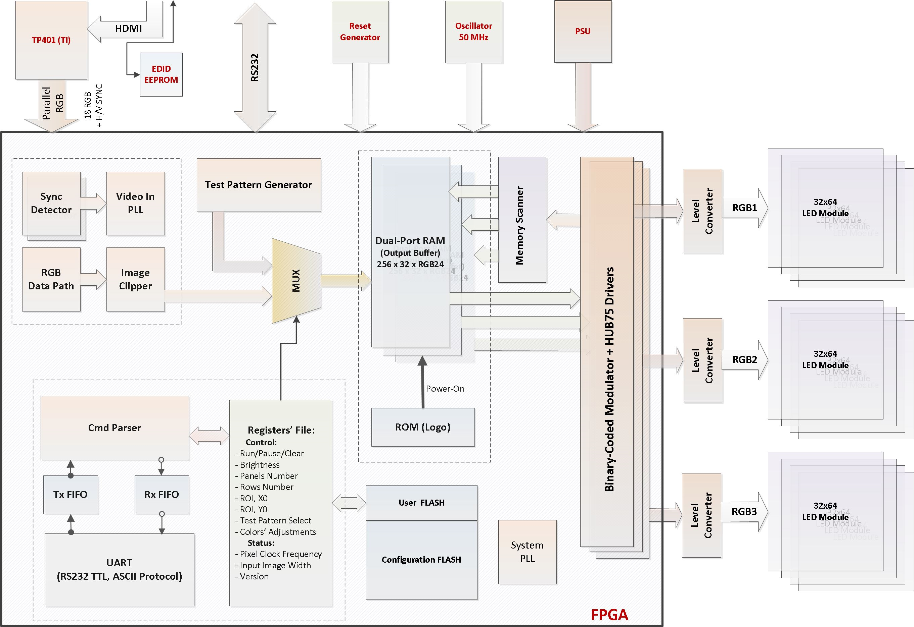

# LEDMAT3

## HDMI - LED Display Controller (FPGA)

This is a simple FPGA project (and PCB as well) for driving the common LED RGB-matrixes based on the popular drivers. MBI5124, MBI5153, and ICN2038 chips.
The input data is derived from:
* HDMI Input
* TPG (test pattern generator),
* BMP image, downloaded to FPGA RAM

The USB-VCP port allows to control the basic LED display parameters without recompiling the project.

### Compatible driver ICs:
* MBI5124, TC5020, and similar
* ICN2038
* MBI5153

### The fillowing LED panels are supported: 
* up to 3 lanes, each up to 32 rows
* up to 384 columns in the each lane
* Non-cascaded panels (like Longrunled 120x90) are supported using a virtual internal chaining

### Suported functionalities 
* On-board EDID
* HDMI clock detection
* Last image hold
* Variable refresh ratio, brightness, multiplex ratio
* Onboard USB VCP for remote control the display parameters
* USB- or External- powering

#### Other basic panels' configurations may be set via the project defines.

